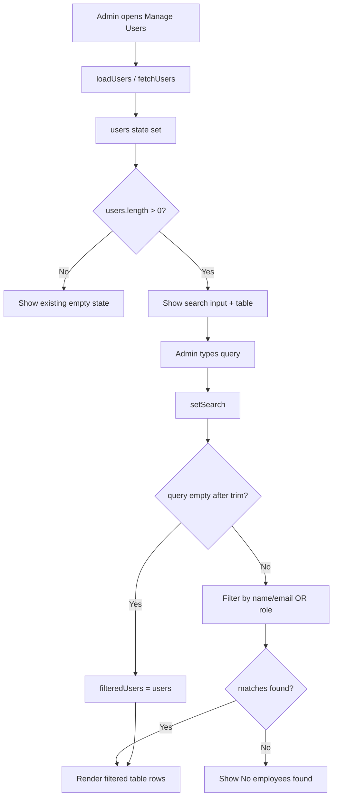
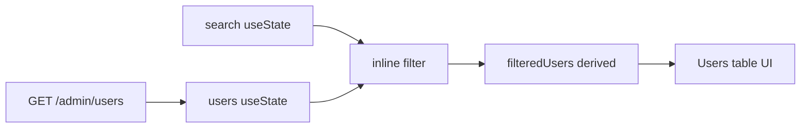

# Feature Documentation

## 1. Feature Name

**Employee Search on Admin → Users (Manage Users)**

---

## 2. Purpose

### Business problem
As the employee list grows, admins spend extra time scrolling through the full Users table to find a specific employee or role group (for example, all `ADMIN` users). That slows down day-to-day access management.

### User problem
Admins needed a fast way to locate employees by **name** or **role** without leaving the Users page, opening filters elsewhere, or calling a new API.

### Why this feature was added
To improve admin productivity on the existing Manage Users screen with a lightweight, real-time search that works entirely on already-loaded user data.

---

## 3. Summary

This feature adds a search input above the Users table on the Admin Manage Users page.  
As the admin types, the table filters in real time (case-insensitive) by employee name and role.  
When the search box is empty, the full user list is shown again.  
If no rows match, the UI shows: **No employees found.**  
No backend, API, routing, or layout redesign was introduced.

---

## 4. Files Modified

| File | Type of Change | Description |
|------|----------------|-------------|
| `frontend/src/pages/Admin/ManageUsers.jsx` | Feature update | Added `search` state, derived `filteredUsers` logic, search input UI above the table, and empty-search-results message. Table now maps over `filteredUsers` instead of `users`. |

**Not modified:** backend Lambdas, CloudFormation/SAM templates, `api.js`, routes, theme definitions, Layout, auth services, database schema.

---

## 5. Components Affected

| Area | Status |
|------|--------|
| **React Components** | `ManageUsers` (updated). Nested local helper `ProfileRow` unchanged. |
| **Hooks** | Existing `useState` / `useEffect` reused. New state: `search`. No custom hooks added. |
| **Context** | Not Found |
| **Utility Functions** | Not Found (filtering is inline in the component) |
| **APIs** | Not modified. Still uses existing `fetchUsers()` → `GET /admin/users` |
| **Services** | `frontend/src/services/api.js` — Not modified |
| **Routes** | `/admin/users` in `App.jsx` — Not modified |
| **Backend Functions** | Not Found / Not modified |
| **Database Changes** | Not Found / Not modified |

---

## 6. Implementation Details

### 1. What was implemented
- A controlled text input above the users table
- Client-side filtering of the existing `users` array
- Empty-result messaging for non-matching queries

### 2. How it works
1. Users are loaded once (and on refresh after create/edit/status/role/delete) into `users` via `loadUsers()`.
2. Admin types into the search box → `setSearch` updates `search`.
3. On each render, a derived list `filteredUsers` is computed from `users` + `search`.
4. The table renders `filteredUsers`.

### 3. Data flow
```
GET /admin/users  →  users state  →  filter by search query  →  filteredUsers  →  table UI
```

### 4. State management
| State | Purpose | New? |
|-------|---------|------|
| `users` | Source of truth for employee list from API | No |
| `search` | Current search text | **Yes** |
| `filteredUsers` | Derived (not stored in `useState`) | **Yes (derived)** |
| Other existing states (`loading`, `error`, modals, form, etc.) | Unchanged | No |

### 5. API flow
**No new API calls for search.**  
Search does not hit the network. It only filters the already-fetched `users` array.

Existing load flow (unchanged):
```
ManageUsers mount → loadUsers() → fetchUsers() → GET /admin/users → setUsers(...)
```

### 6. Error handling
- Search itself has no async path, so no new API error handling.
- Existing load error handling remains:
  - Failed `fetchUsers` → `error` banner + `users = []`
- Empty search results are a UI state, not an error: **"No employees found."**

### 7. Edge cases handled
| Edge case | Behavior |
|-----------|----------|
| Empty search / whitespace-only | Shows all users (`trim()` then empty → no filter) |
| Case differences (`admin` vs `ADMIN`) | Case-insensitive via `.toLowerCase()` |
| No matching rows | Shows **"No employees found."** |
| Zero users in system | Existing empty state: **"No users found yet"** (search bar not shown) |
| Missing `name` on user object | Falls back to `email` for name matching (`u.name \|\| u.email`) |
| Missing `role` | Treated as empty string |

---

## 7. Before vs After

### Before
- Admin opened **Manage Users** and always saw the full table.
- Finding someone required visual scanning of every row.
- No search input and no filtered empty-state message.

### After
- A search bar appears above the table (when at least one user exists).
- Typing filters rows instantly by name/email and role.
- Clearing the box restores the full list.
- Non-matching queries show **"No employees found."**
- Create User, profile view, role change, block/activate, edit, and delete behave as before.

---

## 8. Technical Details

| Item | Detail |
|------|--------|
| **Functions Added** | Not Found (no named new function; filtering is inline) |
| **Functions Updated** | Render path of `ManageUsers` now uses `filteredUsers` for the table body |
| **Components Added** | Not Found (no new component file; search is an `<input>` inside `ManageUsers`) |
| **Props Changed** | Not Found |
| **State Variables** | Added: `search` (`useState("")`) |
| **Derived values** | `query`, `filteredUsers` |
| **API Endpoints** | None added. Existing: `GET /admin/users` via `fetchUsers()` |
| **Validation Logic** | Search uses `trim()`; no schema validation beyond string matching |
| **Authentication Changes** | Not Found |
| **Authorization Changes** | Not Found (page still admin-routed as before) |
| **Environment Variables** | Not Found |
| **Configuration Changes** | Not Found |

### Filter logic (as implemented)

```javascript
const query = search.trim().toLowerCase();
const filteredUsers = !query
  ? users
  : users.filter((u) => {
      const name = String(u.name || u.email || "").toLowerCase();
      const role = String(u.role || "").toLowerCase();
      return name.includes(query) || role.includes(query);
    });
```

### UI control (as implemented)

```javascript
<input
  type="text"
  value={search}
  onChange={(e) => setSearch(e.target.value)}
  placeholder="Search by Employee Name or Role"
  style={formInput}
  aria-label="Search by Employee Name or Role"
/>
```

**Note from code analysis:** `GET /admin/users` currently returns objects shaped like `{ email, role, status, createdAt }` (backend `admin/handler.js`). A dedicated `name` field is often absent in list data; the UI therefore falls back to `email` when matching “name”.

---

## 9. Code Flow

### Search execution flow

```text
Admin opens /admin/users
        ↓
ManageUsers mounts
        ↓
useEffect → loadUsers() → fetchUsers() → GET /admin/users
        ↓
users state populated
        ↓
Admin types in search input
        ↓
onChange → setSearch(value)
        ↓
Re-render → compute query + filteredUsers
        ↓
filteredUsers.length === 0 ?
   Yes → show "No employees found."
   No  → render table rows from filteredUsers
```

### Mermaid — search workflow



### Mermaid — data relationship



---

## 10. Architecture Impact

| Layer | Impact |
|-------|--------|
| Presentation (`ManageUsers.jsx`) | Small UI + derived filter added |
| Shared theme (`theme.js`) | Reused `formInput`, `colors` — no file change |
| API service layer | None |
| Auth / Cognito | None |
| Backend / DynamoDB / Cognito admin APIs | None |
| Routing | Still `/admin/users` |

The feature fits the existing pattern: page-level React state, shared inline styles from `theme.js`, and service helpers in `api.js` for network calls only when needed.

---

## 11. Performance Considerations

| Topic | Assessment |
|-------|------------|
| **Rendering impact** | Filter runs on every keystroke during render. Acceptable for typical admin user-list sizes. |
| **API optimization** | Search adds **zero** extra API calls. |
| **Lazy loading** | Not Found / Not used for this feature |
| **Memoization** | Not used (`useMemo` / `useCallback` not introduced) |
| **Improvements** | Faster admin lookup without full-page reload or extra network round-trips |
| **Possible bottlenecks** | Very large user lists could make naive `.filter()` on each keystroke noticeable; not observed as a problem for current expected scale |

---

## 12. Security Considerations

| Topic | Assessment |
|-------|------------|
| **Authentication** | Unchanged. Page still requires logged-in session (token used by existing `api()` helper). |
| **Authorization** | Unchanged. Route remains under admin guard in `App.jsx`; backend `GET /admin/users` still requires admin. |
| **Input Validation** | Search is client-side substring match only; not sent to backend. |
| **Sanitization** | React text rendering escapes content; search value is not interpolated as HTML. |
| **Protected Routes** | Not changed |
| **Sensitive Data Handling** | Search operates on data already shown in the admin table (email/role). No new sensitive fields exposed. |

---

## 13. Error Handling

| Scenario | Handling |
|----------|----------|
| Users API failure on page load | Existing error banner: *"Unable to load users..."*; `users = []` |
| Search with no matches | UI message: **"No employees found."** (not treated as an exception) |
| Search-specific network failure | Not Found (search is offline/client-side) |
| Invalid search characters | Treated as normal string; no crash path identified |
| Create/Edit/Delete failures | Existing alerts unchanged; unrelated to search |

---

## 14. Testing Checklist

- [ ] Feature works correctly on Admin → Users
- [ ] Search bar appears above the table when users exist
- [ ] Typing filters results in real time
- [ ] Search is case-insensitive (e.g. `admin` matches `ADMIN`)
- [ ] Searching by role (`USER` / `ADMIN`) works
- [ ] Searching by email/name substring works
- [ ] Empty search restores full list
- [ ] No matches shows **"No employees found."**
- [ ] True empty directory still shows **"No users found yet"**
- [ ] API success path for initial `fetchUsers` still works
- [ ] API failure path still shows load error banner
- [ ] Loading state still shows *"Loading users..."*
- [ ] Create User still works
- [ ] Edit Profile / Block / Activate / Delete still work
- [ ] Role dropdown still works after filtering
- [ ] Profile view click still works on filtered rows
- [ ] Responsive layout still usable on smaller widths
- [ ] Browser smoke test (Chrome / Edge / Firefox)

---

## 15. Future Improvements

1. Include a real `name` (and optional department) field in `GET /admin/users` so name search does not rely on email fallback.
2. Debounce search input if the user list becomes very large.
3. Extract a small reusable `SearchInput` / `useListFilter` helper for other admin tables.
4. Highlight matching text in results.
5. Add clear (`×`) button inside the search field.
6. Optional `useMemo` for `filteredUsers` if profiling shows render cost.
7. Column visibility for Name in the table to match search semantics more clearly.

---

## 16. Git Information

**Feature Branch Name:**
```text
feature/admin-users-employee-search
```

**Commit Message:**
```text
Add real-time employee search on Admin Manage Users page

Filter the existing users list by name/email and role on the frontend
without backend or API changes.
```

**PR Title:**
```text
feat(admin): add employee search on Manage Users
```

**PR Description:**
```text
## Summary
- Adds a search bar above the Admin → Users table
- Filters users in real time by name/email and role (case-insensitive)
- Shows "No employees found." when there are no matches

## Scope
- Frontend only: `ManageUsers.jsx`
- No backend/API/routing changes

## Test plan
- [ ] Open Admin → Users and confirm search bar visibility
- [ ] Search by role and by email substring
- [ ] Clear search and confirm full list restores
- [ ] Verify create/edit/block/delete still work
```

---

## 17. Risks

| Risk | Severity | Notes |
|------|----------|-------|
| Name search may miss users if `name` is absent and query does not match email | Medium | Current list API often omits `name`; fallback is email |
| Admins may expect department search (earlier requirement draft) but current placeholder is Name or Role | Low | Aligns with latest implemented requirement |
| Filtering only client-side means newly created remote users appear only after `loadUsers` refresh | Low | Same as previous page behavior |
| No regression expected in business actions, but table now iterates `filteredUsers` | Low | Actions still call same handlers with `u.email` |

---

## 18. Dependencies

| Category | Items |
|----------|-------|
| **Packages** | Existing React (`useState`, `useEffect`). No new npm packages. |
| **Components** | `Layout`, local `ProfileRow` (unchanged) |
| **Theme / styles** | `formInput`, `colors`, `pageCard`, `pageTitle`, `pageSubtitle`, `buttonPrimary` from `../../theme` |
| **APIs** | Existing `fetchUsers` only for list load (not for search) |
| **Services** | `../../services/api`, `../../services/auth` (auth helpers unchanged for this feature) |
| **Hooks** | Built-in React hooks only |

---

## 19. Screens or UI Changes

| UI element | Change |
|------------|--------|
| Page title / subtitle / Create User button | Unchanged |
| Search input | **Added** directly above the users table |
| Placeholder text | `Search by Employee Name or Role` |
| Table columns / styling | Unchanged |
| Empty directory state | Unchanged (`No users found yet`) |
| Filtered empty state | **Added**: `No employees found.` |
| Modals (profile view / create-edit) | Unchanged |
| Colors / spacing system | Reused existing `formInput` style; no redesign |

---

## 20. Conclusion

The Employee Search feature improves the Admin Manage Users experience with minimal code change and zero backend impact.  
Admins can instantly narrow the employee table by typing a name/email fragment or role.  
Filtering is performed on the frontend against the already-loaded `users` array, keeping network usage unchanged.  
The implementation reuses existing theme styles and preserves all prior user-management actions.  
Empty search restores the full list; unmatched queries show a clear **"No employees found."** message.  
The only modified file is `frontend/src/pages/Admin/ManageUsers.jsx`.  
This change is suitable for a focused feature branch, small PR, and direct inclusion in the project wiki.

---

*Generated from analysis of the implemented code in `ManageUsers.jsx` and related existing services/routes. Items marked **Not Found** were not present in the change set.*
