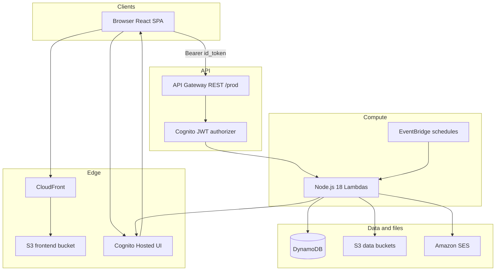
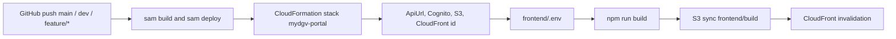

# 02 — System high-level design

**Last verified:** 20 September 2026  
**Sources:** `backend/template.yaml`, `backend/samconfig.toml`, `.github/workflows/main.yml`, `frontend/src/services/auth.js`, `frontend/src/services/api.js`

## Summary

| Layer | Technology | Verified location |
|---|---|---|
| UI | React 19 SPA (CRA `react-scripts` 5) | `frontend/` |
| SPA host | S3 + CloudFront (HTTPS redirect) | `FrontendBucket`, `FrontendDistribution` |
| Auth | Cognito User Pool + Hosted UI | `CognitoUserPool*` |
| API | API Gateway REST, stage `prod` | `ApiGateway` |
| Compute | Lambda Node.js 18 | `Globals.Function.Runtime` |
| Data | DynamoDB on-demand | tables in SAM |
| Files | S3 + presigned URLs | profile, training, documents, agent, frontend |
| Email | SES | IAM on selected functions |
| Clocks | EventBridge → Lambda | `Type: Schedule` events |
| Region | `ap-south-1` | `samconfig.toml`, GitHub Actions |
| IaC | AWS SAM | `backend/template.yaml` |
| Deploy | GitHub Actions | `.github/workflows/main.yml` |

## Container diagram

## Request flow (browser)

1. User loads SPA from CloudFront (or webpack dev server).
2. Unauthenticated users hit `/login` and are redirected to Cognito Hosted UI (`response_type=token`).
3. Callback stores **id token**; SPA calls Lambdas through API Gateway.
4. Gateway **Cognito authorizer** validates JWT (default authorizer; OPTIONS preflight excluded).
5. Lambda reads `event.requestContext.authorizer.claims` via `getUser()`.
6. Handler reads/writes DynamoDB and/or issues S3 presigned URLs; JSON response with CORS `*`.

Employee dashboard is **not** a dedicated backend resource. `Dashboard.jsx` composes `GET /tasks?mine=true`, `GET /leave`, `GET /announcements`.

## Background processing flow

EventBridge invokes the **same** Lambda handlers used for HTTP. Handlers detect schedule payloads (`httpMethod` absent + flags such as `taskEscalation: true`).

Verified jobs:

- Task Green/Orange/Red persistence and related notify (`ProjectsFunction`, 5 minutes)
- Leave auto-approve after configured hours (`LeaveFunction`, 5 minutes)
- Announcement expiry logging (`AnnouncementsFunction`, 5 minutes)
- Meeting reminders (`MeetingsFunction`, 5 minutes)
- Daily attendance/document/training emails (`NotificationsFunction`, `cron(30 3 * * ? *)` — described in SAM as 09:00 IST)

`NotificationsFunction` has **no HTTP events** in SAM.

## Deployment boundary

One stack contains **backend and frontend infra**. The React build is not inside the SAM artifact; CI builds it after stack outputs exist.

## Deployment items **unverified** in repo

- Route53 / DNS records for `login.mydgv.com`
- ACM certificate and CloudFront aliases (distribution has no `Aliases` / `ViewerCertificate` in `template.yaml`)
- Which CloudFront domain users actually type if DNS is configured outside SAM

`FrontendURL` output is `https://${FrontendDomainName}` — that is a **parameter**, not proof of DNS.

## CORS and clients

API CORS: `AllowOrigin: '*'`, headers `Authorization,Content-Type`. Native mobile apps would not need CORS; the **auth grant and callback URLs** are still web-specific (see `07-authentication-authorization.md`).
