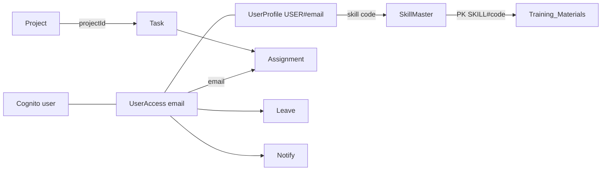

# 05 — Data architecture

**Last verified:** 20 September 2026  
**Sources:** `backend/template.yaml`, Lambda `Put`/`Query`/`Get` usage  

DynamoDB here is **document / key-value**, not a relational database. Relationships are encoded in partition/sort keys and attributes (typically `email`, `projectId`, `taskId`). There are **no foreign-key constraints**.

Physical table names: `{CloudFormationStackName}-{suffix}`. Stack default: `mydgv-portal` (`samconfig.toml`).

---

## Tables defined in SAM

All listed tables: BillingMode `PAY_PER_REQUEST`, key schema `PK` (HASH) + `SK` (RANGE), types String.

### Users (`UsersTable`)

| | |
|---|---|
| Name pattern | `{stack}-Users` |
| PK / SK | `PK`, `SK` |
| GSI | none |
| Purpose | Defined in SAM only |
| Consumers | **None found.** Globals set `USERS_TABLE` but no Lambda `require`/env usage of `USERS_TABLE` was found |
| Access patterns | Unknown (no writers in repo) |

### Attendance (`AttendanceTable`)

| | |
|---|---|
| Name | `{stack}-Attendance` |
| PK / SK | email (typical), date |
| GSI | `DateIndex`: `GSI1PK` HASH, `GSI1SK` RANGE |
| Purpose | Daily attendance, check-in/out |
| Consumers | AttendanceFunction, LeaveFunction (status writes), NotificationsFunction (read) |
| Patterns | Get `PK=email, SK=date`; query GSI `GSI1PK=DATE#{date}` for org activity |

### WorkTasks (`WorkTasksTable`)

| | |
|---|---|
| Name | `{stack}-WorkTasks` |
| Env | `WORK_TABLE` |
| GSI | none |
| Purpose | Operational single-table for projects, tasks, leave, notify, announcements, meetings, consent, KYC documents, software catalog, task import metadata |
| Consumers | Projects, Leave, Work, Consent, Announcements, Meetings, Documents (KYC), Software, Notifications (CRUD notify/reminders), Activity (reads projects/tasks/leave for dashboard) |
| Patterns | Query `PK = ENTITY#…` or `PK = USER#…` / `TASK#…` / `PROJECT#…` / `IMPORT#…` |

See key catalog below. **Project/personal document folder trees are not stored here** (S3 manifests).

### Performance (`PerformanceTable`)

| | |
|---|---|
| Name | `{stack}-Performance` |
| GSI | none |
| Purpose | Intended performance records |
| Consumers | PerformanceFunction has the env from Globals; handler **hardcodes** hours/rating and reads **TrainingProgress** for points |
| Patterns | No verified WorkTasks-style keys in `performance/handler.js` |

### TrainingProgress (`TrainingProgressTable`)

| | |
|---|---|
| Name | `{stack}-TrainingProgress` |
| PK / SK | email / video id (`training/handler.js`) |
| Purpose | Progress for **hardcoded** `/training` videos |
| Consumers | TrainingFunction, PerformanceFunction, NotificationsFunction (read) |

### UserAccess (`UserAccessTable`)

| | |
|---|---|
| Name | `{stack}-UserAccess` |
| PK / SK | email / email (`access/handler.js`) |
| Purpose | Portal role, status `ACTIVE` \| `PENDING` \| `BLOCKED` |
| Consumers | Access, Admin, UserProfileFunction, Leave (approvers/scan), Notifications (active employees), Projects (assignee blocked check) |
| Patterns | GetItem exact key; Scan for admin user list and admin email fan-out |

### UserProfile (`UserProfileTable`)

| | |
|---|---|
| Name | `{stack}-UserProfile` |
| PK / SK | `USER#{email}` / `PROFILE` |
| Purpose | Name, empId, phone, designation, skill, manager, photo keys, HR document fields |
| Consumers | UserProfile, UserProfileFunction, many readers for display names and skill |

### Training_Materials (`TrainingMaterialsTable`)

| | |
|---|---|
| Name | `{stack}-Training_Materials` |
| PK / SK | `SKILL#{code}` / `TRAINING#{id}` (`addTraining/app.mjs`) |
| Purpose | Skill-scoped training metadata (`video_s3_key`, `is_active`) |
| Consumers | addTraining, UserTrainingList, NotificationsFunction |

### SkillMaster (`SkillMasterTable`)

| | |
|---|---|
| Name | `{stack}-SkillMaster` |
| PK / SK | `SKILL` / skill code (`getSkills/app.mjs`) |
| Purpose | Active skill catalog `{ code, name }` |
| Consumers | getSkills |

### Resignations (`ResignationsTable`)

| | |
|---|---|
| Name | `{stack}-Resignations` |
| Purpose | Exit requests |
| Consumers | resignation Lambda |

Exact PK/SK attribute names follow the same PK/SK schema; item shapes are in `backend/lambda/resignation/app.mjs` (not fully expanded here).

### ActivityLog (`ActivityLogTable`)

| | |
|---|---|
| Name | `{stack}-ActivityLog` |
| PK / SK | `USER#{email}` / `EVENT#{iso}#{id}`; also `SUMMARY#{email}` / `DAY#{date}` |
| GSI | `DateIndex` `GSI1PK`/`GSI1SK` (`DATE#{date}`) |
| Purpose | Login, heartbeat, page events |
| Consumers | ActivityFunction |
| Patterns | Query user events; query GSI by date for admin dashboard |

---

## WorkTasks key patterns (verified writers)

| Entity | PK | SK | Notes |
|---|---|---|---|
| Project | `ENTITY#PROJECT` | `PROJECT#{projectId}` | `projectManage.js`, create in `handler.js` |
| Task (canonical) | `ENTITY#TASK` | `TASK#{taskId}` | |
| Task (project copy) | `PROJECT#{projectId}` | `TASK#{taskId}` | denormalized copy |
| Assignment | `TASK#{taskId}` | `ASSIGNMENT#{email}` | independent status/zone |
| Comment | `TASK#{taskId}` | `COMMENT#{iso}#{id}` | |
| Activity line | `TASK#{taskId}` | activity SK from `appendActivity` | |
| Attachment metadata | `TASK#{taskId}` | attachment SK | blobs on profile-images bucket |
| Time entry | `USER#{email}` | time-entry SK | `handler.js` time-entries |
| Leave (canonical) | `ENTITY#LEAVE` | `LEAVE#{id}` | |
| Leave (user copy) | `USER#{email}` | `LEAVE#{id}` | |
| Notification | `USER#{email}` | `NOTIFY#{iso}#{id}` | `common/notify.js` |
| Reminder lock | `USER#{email}` | `REMINDER#{type}#{dedup}` | |
| Announcement | `ENTITY#ANNOUNCE` | `ANN#{id}` | |
| Meeting | `ENTITY#MEETING` | `MEETING#{id}` | plus `MEETING#{id}` participant copies, `USER#{email}` copies |
| Consent | `ENTITY#CONSENT` | `{email}` | |
| KYC document | `ENTITY#DOCUMENT` | `DOC#{id}` | plus `USER#{email}` `CURRENT#{type}` |
| Doc type | `ENTITY#DOC_TYPE` | `TYPE#{code}` | |
| Software | `ENTITY#SOFTWARE` | `SW#{softwareId}` | |
| Task import history | `ENTITY#TASK_IMPORT` | `IMPORT#{uploadedAt}#{batchId}` | |
| Task import batch | `IMPORT#{batchId}` | `META` and `ROW#{n}` | |
| Import audit wait | `ENTITY#TASK_IMPORT_WAIT` | | `taskImport.js` |

---

## S3 (not DynamoDB)

| Bucket logical ID | Purpose |
|---|---|
| FrontendBucket | SPA `build/` |
| ProfileImagesBucket | Profile photos; **task attachments** (`TASK_ATTACHMENTS_BUCKET`) |
| TrainingMaterialBucket | Training videos/files |
| DocumentsBucket | KYC uploads; task-import `task-imports/tmp|hold|audit/`; **JSON manifests** `manifests/projects|personal/` and file blobs `files/` |
| AgentDownloadsBucket | Software installers |

Document **folder browsers** use S3 manifests (`common/documentsStorage.js`), not WorkTasks keys.

---

## Logical relationships (not SQL)

