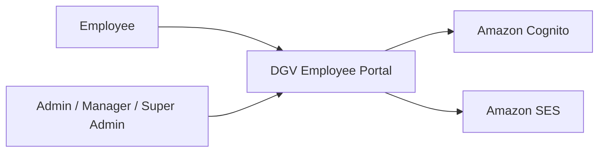
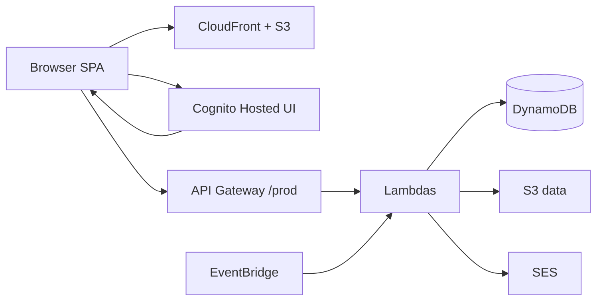
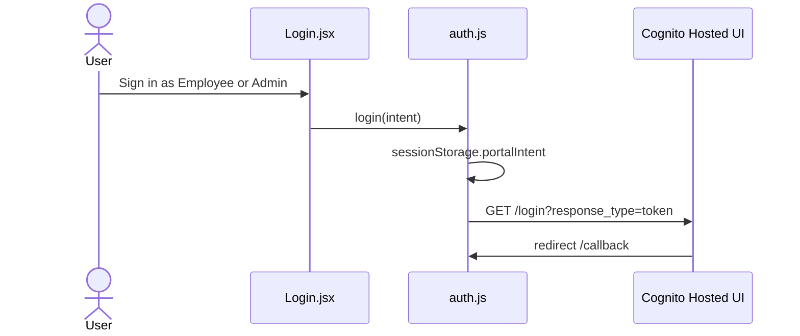
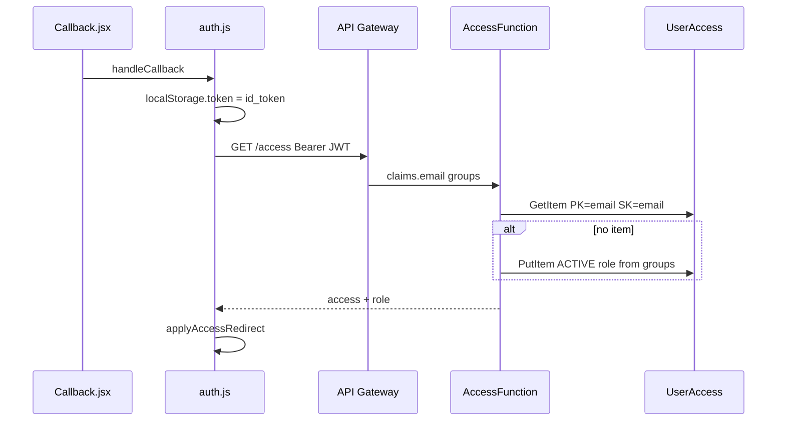
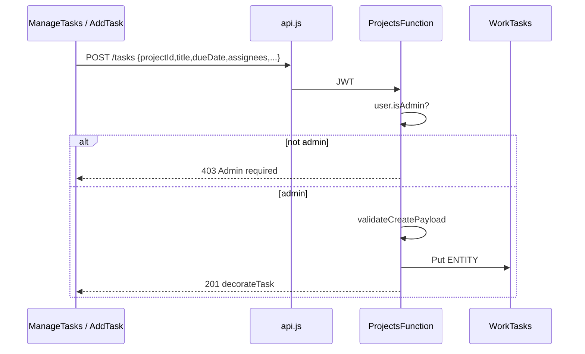
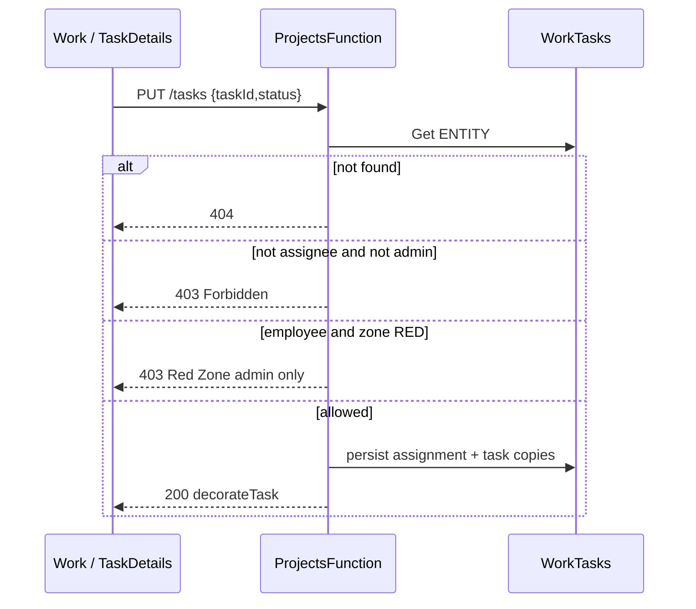
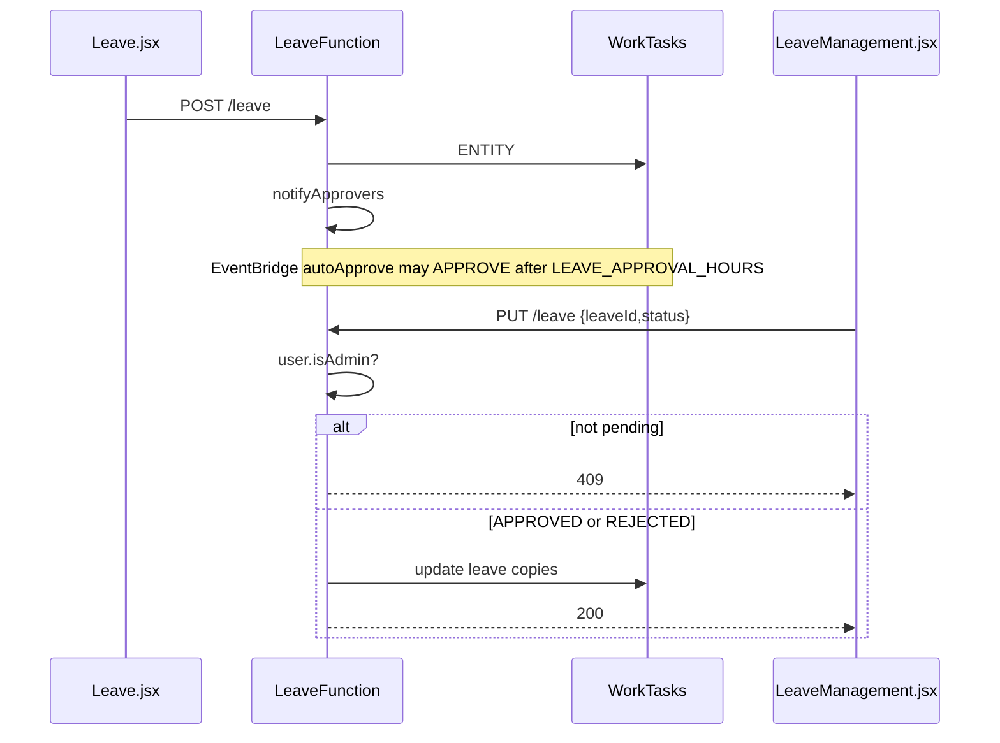
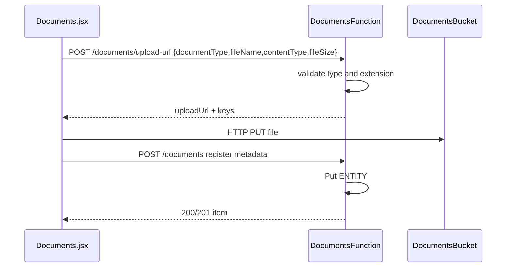
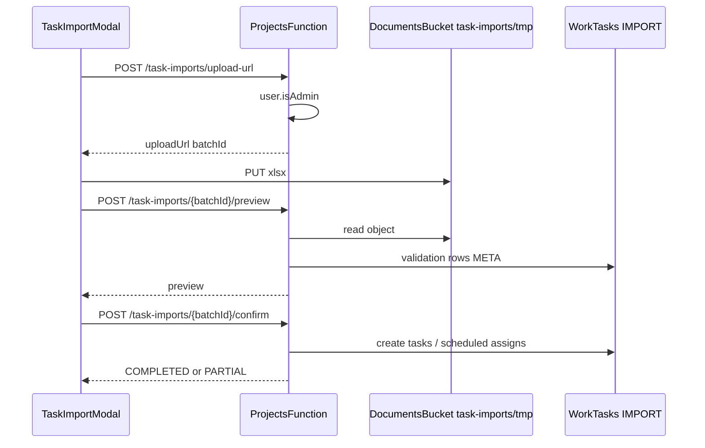
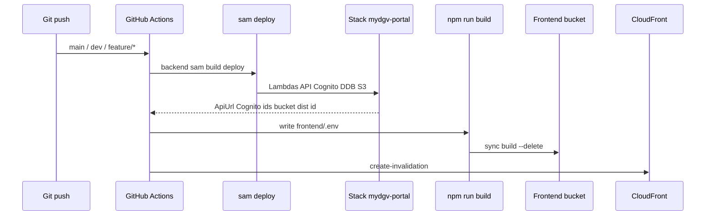

# 09 — UML and sequence diagrams

**Last verified:** 20 September 2026  

Diagrams follow **implemented** code. They omit UI-only placeholders.

---

## 1. System context



---

## 2. Container architecture



---

## 3. Login and authentication



Callback continuation is diagram 4.

---

## 4. Access verification



---

## 5. Task creation

Admin group required (`POST /tasks`).



---

## 6. Task status update



---

## 7. Task escalation

```mermaid
sequenceDiagram
  participant EB as EventBridge 5 min
  participant P as ProjectsFunction
  participant D as WorkTasks
  participant N as notify.js / SES
  EB->>P: {taskEscalation:true}
  P->>D: query tasks and assignments
  P->>P: zoneAt(dueDate, now) vs recordedZone
  P->>D: persist recordedZone / highestZone
  opt new Orange
    P->>N: in-app TASK_ORANGE for assignee
  end
  opt new Red
    P->>N: in-app TASK_RED; admin email path redAdminNotify.js
  end
```

---

## 8. Leave approval



---

## 9. Document upload (presigned URL)

KYC path (`documents/handler.js`). Folder browsers use a similar upload-url then S3 PUT pattern.



---

## 10. Excel task import



---

## 11. Deployment flow



GitHub uses IAM user keys from Actions secrets (`configure-aws-credentials`).
